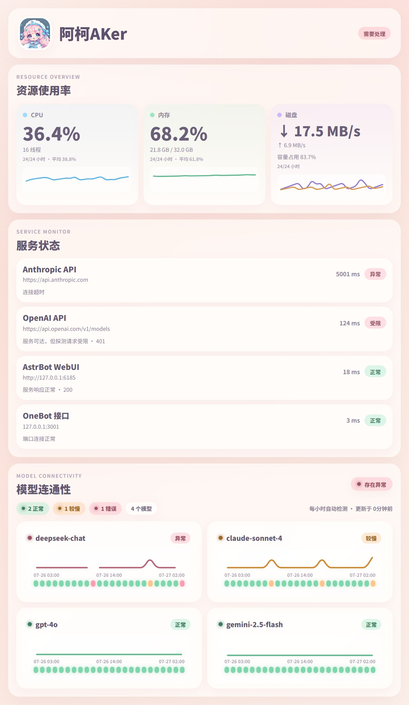

# DashView

DashView 是 AstrBot 的运行状态图片面板。它把主机资源、HTTP/TCP 服务健康和当前已加载模型路由的功能连通性汇总到一张图片中。



## 设计目标

- **可信**：趋势、平均值和可用率只使用真实采样。没有历史就显示“暂无数据”。
- **快速**：主机阻塞采样进入工作线程，服务并发检测，Chromium 进程复用。
- **清晰**：图片按“总状态 → 当前问题 → 资源 → 服务 → 模型证据”组织。
- **可控**：服务与模型详情都有数量上限，被省略的项目会明确标注。
- **安全**：状态查看不会调用模型；模型检测才会产生真实模型请求。页面渲染禁止联网。

当前声明支持 `aiocqhttp` 平台。模型长期监控默认开启：首次运行会向每条未排除的聊天模型发送一次真实请求，之后每小时一次。请先确认供应商费用和额度。

## 安装

在 AstrBot 插件市场安装 `astrbot_plugin_dashview`，或把仓库放入 AstrBot 插件目录。

插件依赖 Playwright Chromium。部署镜像或主机需要在启动 AstrBot 前安装浏览器：

```bash
python -m pip install -r requirements.txt
python -m playwright install chromium
```

Linux 容器缺少浏览器系统依赖时使用：

```bash
python -m playwright install --with-deps chromium
```

DashView 不会在运行期间自动下载浏览器，避免首次请求卡顿和不可控的运行时安装。

## 使用

| 命令 | 作用 |
| --- | --- |
| `运行状态`、`状态`、`status` | 采集当前主机和服务，读取最近模型报告，生成面板 |
| `模型检测`、`模型连通性`、`检测模型` | 仅管理员可用；立即向每条未排除路由发送一次可能计费的真实请求 |

`运行状态` 本身不产生模型调用费用。后台小时监控和每次手动 `模型检测` 都会对每条目标路由产生一条额外真实请求；模型从未检测过时，面板会明确显示“尚未执行模型检测”。

## 服务配置

在 AstrBot 插件配置页添加 HTTP 或 TCP 项。空列表表示不检测外部服务，不会偷偷请求内置默认站点。单项关闭“启用”可临时停用并保留配置。

HTTP 示例：

```json
{
  "name": "业务 API",
  "type": "http",
  "url": "https://example.com/health",
  "method": "GET",
  "headers": {}
}
```

TCP 示例：

```json
{
  "name": "Redis",
  "type": "tcp",
  "host": "127.0.0.1",
  "port": 6379
}
```

HTTP `200-399` 记为健康。`401`、`403`、`405` 只记为“可达但受限”，不会冒充业务健康。为避免状态检测修改业务数据，只支持 `GET` 和 `HEAD`。

## 配置参考

| 配置 | 默认值 | 说明 |
| --- | ---: | --- |
| `service_timeout` | `5` | 单个服务超时秒数 |
| `service_concurrency` | `8` | 服务检测并发上限 |
| `resource_interval_minutes` | `60` | 默认每小时采样一次，`0` 关闭 |
| `resource_history_size` | `24` | 每项资源保留的小时桶数量；同小时只保留最新样本 |
| `model_monitor_enabled` | `true` | 每小时探测一次，每模型每天最多产生 24 次最短调用 |
| `model_exclude_patterns` | `[]` | 不调用的配置 ID、模型名或 `配置ID::模型名` 通配符 |
| `model_timeout` | `30` | 单条模型路由超时秒数 |
| `model_concurrency` | `6` | 模型探测并发上限 |
| `model_slow_ms` | `8000` | 模型成功但标为较慢的阈值 |
| `cpu_warning` / `cpu_critical` | `75` / `90` | CPU 降级和严重阈值 |
| `memory_warning` / `memory_critical` | `80` / `92` | 内存与交换区阈值 |
| `disk_warning` / `disk_critical` | `80` / `92` | 系统分区阈值 |
| `max_service_rows` | `8` | 图片最多展开的服务行数 |
| `max_model_rows` | `8` | 图片最多展开的模型图数量，其他模型仍参与总状态 |
| `cache_keep_count` | `3` | 系统临时目录保留的最近图片数 |

全部配置及 WebUI 提示以 [`_conf_schema.json`](_conf_schema.json) 为准。

## 数据语义

- CPU、内存和交换区趋势使用固定 `0-100%` 纵轴；默认每小时一点，展示最近 24 小时。
- 磁盘卡展示真实读取/写入速率双曲线，容量占用只用于磁盘健康阈值和辅助说明。
- 网络速率由连续两次累计流量计算。首次采样显示“暂无数据”。
- 模型“可用”要求 Provider 调用成功，并且响应内容符合探针要求。
- 模型 Uptime 固定展示当前小时和之前 23 小时：绿为正常、黄为较慢、红为故障、灰为未完成检测。
- 同一小时多次检测保留最差状态和最高延迟，成功重试不会抹掉该小时故障。
- 连续两小时没有新报告后，当前模型状态转为未知；旧曲线只作为历史证据。
- Provider 暂时消失时历史保留 24 小时并显示未知；发现过程异常不会覆盖旧报告。
- 未发现模型、未配置服务、采集失败和真实 `0` 是四种不同状态。
- 历史存入一个版本化 AstrBot KV 文档，报告与历史一次提交，写入失败不会覆盖旧报告。

## 本地开发

安装开发依赖并运行测试：

```bash
uv sync --extra dev
uv run pytest
```

生成不访问外网、不调用模型的确定性预览：

```bash
uv run python -m playwright install chromium
uv run python test.py
```

输出文件为 `output_test.html` 和 `output_test.jpg`。

## 故障排查

### Chromium executable doesn't exist

在 AstrBot 使用的同一 Python 环境执行 `python -m playwright install chromium`，然后重启 AstrBot。

### 面板提示模型尚未检测

执行一次 `模型检测`，或开启 `model_monitor_enabled`。后台监控默认开启，每个聊天模型每小时产生一次最短调用。

### 排除昂贵或限额模型

在 `model_exclude_patterns` 中添加通配符，例如 `*::o3`、`openai-main::*` 或 `expensive-*`。规则可匹配配置 ID、模型名、显示名和完整路由 ID，命中后不会产生探测调用。

### 自定义头像不显示

容器或主机必须能读取 `avatar_local_path`。建议使用 AstrBot 运行环境中的绝对路径；也可以配置 HTTP/HTTPS `avatar_url`。

### 状态数据版本不匹配

2.0.0 不迁移旧内部状态。错误信息会指出新状态键 `dashboard_state_v2`，从 AstrBot 插件 KV 中删除该键即可重新建立历史。

### 图片高度超过限制

降低 `max_service_rows` 或 `max_model_rows`。汇总数量始终覆盖全部检测结果，降低详情行数不会影响健康结论。

## 项目结构

```text
main.py                 AstrBot 事件入口与消息反馈
config.py               配置验证和边界收紧
state.py                单一 KV 状态结构与原子读写
commands/               状态、模型、资源和后台调度指令
collectors/             主机、服务、Provider 和头像事实采集
presentation/           可信视图、HTML、Chromium 和临时图片
resources/              Jinja2 模板、CSS 和默认头像
tests/                  不访问真实外部系统的自动化测试
```

## 许可证

GNU Affero General Public License v3.0，详见 [LICENSE](LICENSE)。
